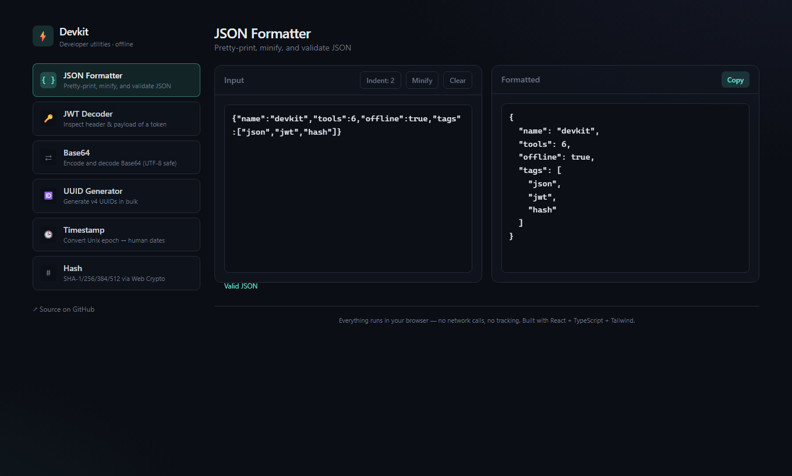
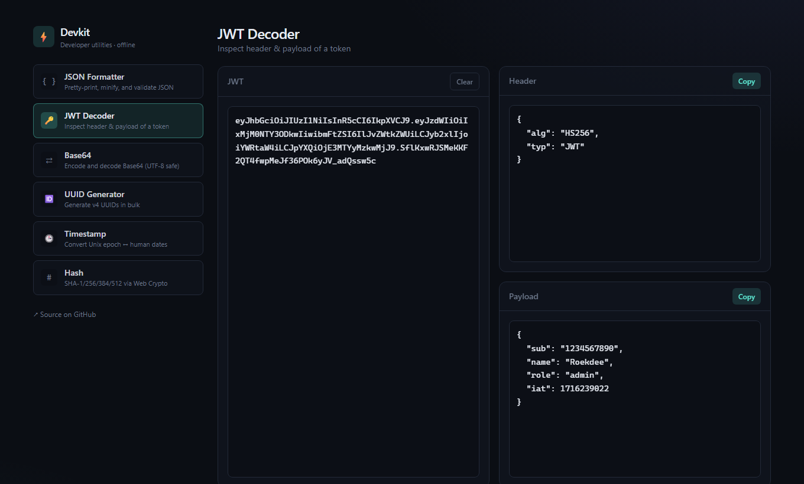
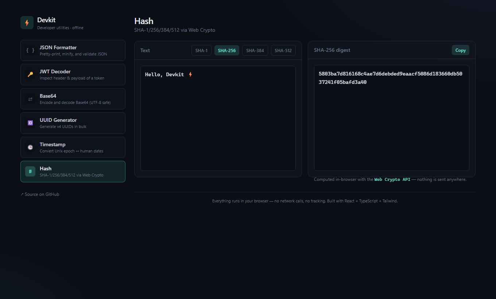

<div align="center">

# Devkit

A small toolbox of the developer utilities I kept reaching for, all in one tab.

[](https://roekdee.github.io/devkit/)
&nbsp;




</div>

---

I was bouncing between random websites every time I needed to decode a JWT or format some JSON, so I put the ones I use most into a single app. It all runs in the browser — there's no backend, so whatever you paste in stays on your machine.

The tools:

- **JSON Formatter** — pretty-print, minify, validate, with the parse error shown inline.
- **JWT Decoder** — shows the header and payload and flags expiry. It does *not* verify the signature (that needs the secret), so treat it as a viewer.
- **Base64** — encode/decode, UTF-8 safe, one button to swap direction.
- **URL Encode** — percent-encode and decode URL components.
- **UUID Generator** — v4 UUIDs in bulk via `crypto.randomUUID()`.
- **Timestamp** — Unix epoch to/from ISO, local, and relative time.
- **Hash** — SHA-1/256/384/512 using the Web Crypto API.

<div align="center">


</div>

Tools are registered in [`src/tools/registry.ts`](src/tools/registry.ts) — one entry plus one component file and the sidebar, routing, and layout pick it up. Routing is hash-based (`/#/jwt`) so each tool is linkable and the static build works on GitHub Pages without server rewrites. The dark theme lives in [`src/index.css`](src/index.css) using Tailwind v4's `@theme`.

## Run locally

```bash
npm install
npm run dev        # http://localhost:5173/devkit/
npm run build      # type-check + production build to dist/
```

## Deploy

Pushing to `main` runs the GitHub Actions workflow in [`.github/workflows/deploy.yml`](.github/workflows/deploy.yml), which builds and publishes `dist/` to GitHub Pages. The live demo updates on its own.

## Tech

React 19, TypeScript 5, Vite 6, Tailwind CSS v4, Web Crypto API, GitHub Actions to Pages.

## Notes

The pluggable registry is the part I'm happiest with — adding a tool really is just two small changes and nothing else has to know about it.

A few honest caveats. The JWT decoder doesn't (and can't, client-side) verify signatures, so it won't catch a tampered token — it's for reading, not trusting. Everything is in-memory: there's no history, and a refresh clears whatever you had open. And the bundle isn't code-split yet, so every tool loads up front. That's fine at this size but I'd split it if I added much more.
